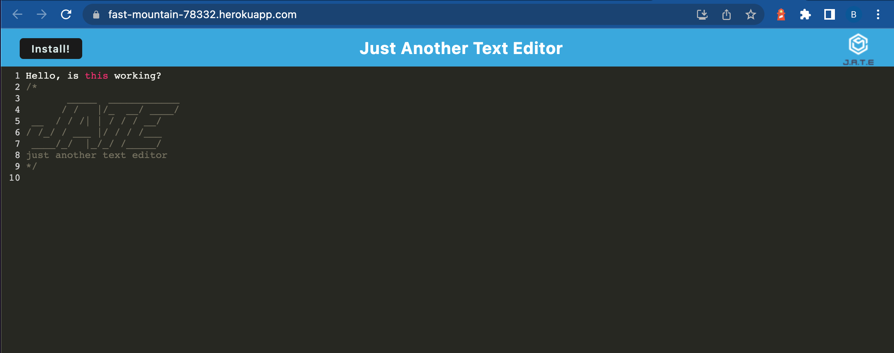
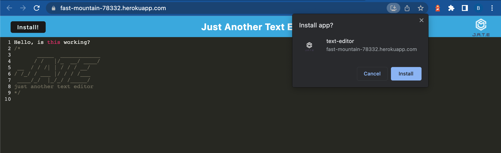

# PWA-Text-Editor

---

## Description

PWA Test Editor is an text editor that runs in the browser and the application can also function offline.

This application is deployed to Heroku
[Heroku Deployment Guide on The Full-Stack Blog](https://coding-boot-camp.github.io/full-stack/heroku/heroku-deployment-guide).

---

## Table of Contents

- [Installation](##Installation)

- [Usage](##Usage)

- [License](##License)

- [Tests](##Tests)

- [Questions](##Questions)

---

## Installation

- First, use git clone in the terminal to download the project
- Then open the project in VS Code and enter the terminal by right clicking the package.json
- Within the terminal, use npm install install to install the all packages
- Open server in terminal by using npm start
- The routes can be tested by using Insomnia

## Usage

Can be used an simple text editor online or offline. 

### Screenshot:

### Walkthrough Video:

[![Watch the video here]](https://drive.google.com/file/d/1QTtUpXADpg4hcaVns7HmgPFpLEkFPRVQ/view?usp=sharing)

---

## License

https://opensource.org/licenses/MIT

---

## Tests

There are no tests for this application.

---

## Questions

If you have any questions or concerns please contact me at bxz5089@gmail.com or checkout my GitHub page at [bxz5089](https://github.com/bxz5089/).
